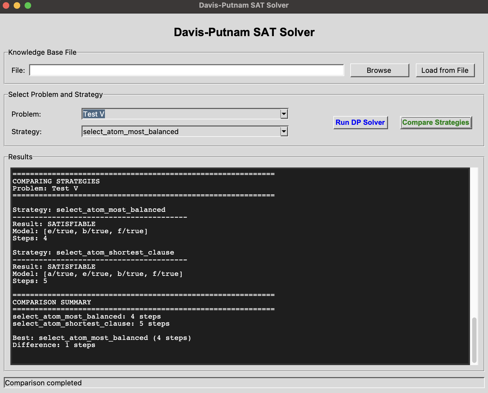

<h1>Knowledge Representation and Reasoning</h1>

<h2>Implementation of Resolution and SAT Solver using Davis-Putnam procedure</h2>



<br>
<hr>
<h2>About it</h2>

<p>The current application implements two fundamental automated reasoning algorithms: Resolution for first-order logic and the Davis-Putnam procedure for propositional satisfiability.</p>

<p>The project addresses logical inference problems by converting knowledge bases to Conjunctive Normal Form (CNF) and applying systematic proof procedures. These techniques form the foundation of automated theorem proving and are widely used in AI systems for reasoning and verification.</p>

<p>The code purpose is to solve the following main tasks:</p>
<ol>
    <li>Convert first-order logic statements to CNF representation</li>
    <li>Apply resolution refutation to prove logical entailment</li>
    <li>Implement SAT solver using Davis-Putnam algorithm with multiple selection strategies</li>
</ol>

<p>The implementation is done in Prolog, leveraging its natural support for logical operations and unification.</p>

<br>
<hr>
<h2>How to use it</h2>

> **NOTE**: For this you will need to have <code>SWI-Prolog</code> installed. If you do not have it, you can install it by following the instructions from the <a href="https://www.swi-prolog.org/Download.html">official documentation</a>.

<p>For using the provided application you will need to install SWI-Prolog by running the following code:</p>

For `MacOS` using Homebrew:

```bash
brew install swi-prolog
```

For `Ubuntu/Debian`:

```bash
sudo apt-get update
sudo apt-get install swi-prolog
```

For `Windows`:

<p>Download the installer from the <a href="https://www.swi-prolog.org/Download.html">official website</a> and follow the installation wizard.</p>

<p>After the installation is complete, you can run the Prolog interpreter:</p>

```bash
swipl
```

<p>To load the resolution implementation:</p>

```prolog
?- [resolution].
```

<p>To load the Davis-Putnam SAT solver:</p>

```prolog
?- [davis_putnam].
```

<p>After loading, you can run queries directly in the Prolog interpreter.</p>

<br>
<hr>
<h2>How it works</h2>

<p>The application implements two distinct reasoning algorithms: Resolution for first-order logic and Davis-Putnam for propositional SAT solving.</p>

<h3>1. Resolution Theorem Proving</h3>

<p>Resolution is a refutation-based proof procedure that works by attempting to derive a contradiction from the negation of the query.</p>

<h4>Example Knowledge Base:</h4>

<p>Consider the following scenario in natural language:</p>
<ol>
    <li>Every student enrolled in a course must complete assignments for that course</li>
    <li>Anyone who completes assignments needs access to reference books</li>
    <li>Reference books can only be borrowed by students with a valid library card</li>
    <li>All students enrolled in the university have a valid library card</li>
    <li>John is a student enrolled in the Artificial Intelligence course</li>
</ol>

<p><strong>Query:</strong> Does John need access to a reference book?</p>

<h4>First-Order Logic Representation:</h4>

<p>The knowledge base is translated to FOL:</p>

```
1. ∀x∀c(Student(x) ∧ Course(c) ∧ Enrolled(x, c) → CompleteAssignments(x, c))
2. ∀x∀c(Student(x) ∧ Course(c) ∧ CompleteAssignments(x, c) → NeedsAccess(x, ReferenceBooks))
3. ∀x(CanBorrow(x, ReferenceBooks) → (HasLibraryCard(x) ∧ Student(x)))
4. ∀x(Student(x) → HasLibraryCard(x))
5. Student(John) ∧ Enrolled(John, AI) ∧ Course(AI)

Query: NeedsAccess(John, ReferenceBooks)
```

<h4>CNF Conversion:</h4>

<p>Each statement is converted to Conjunctive Normal Form:</p>

```
C1: {¬Student(x), ¬Course(c), ¬Enrolled(x, c), CompleteAssignments(x, c)}
C2: {¬Student(x), ¬Course(c), ¬CompleteAssignments(x, c), NeedsAccess(x, ReferenceBooks)}
C3: {¬CanBorrow(x, ReferenceBooks), HasLibraryCard(x)}
C4: {¬CanBorrow(x, ReferenceBooks), Student(x)}
C5: {¬Student(x), HasLibraryCard(x)}
C6: {Student(John)}
C7: {Enrolled(John, AI)}
C8: {Course(AI)}
C9: {¬NeedsAccess(John, ReferenceBooks)} (negated query)
```

<h4>Resolution Process:</h4>

<p>The algorithm applies resolution steps to derive contradictions:</p>

<ol>
    <li><strong>Resolve C1 and C6</strong> (θ₁: {x/John}):
        <br>→ C10: {¬Course(c), ¬Enrolled(John, c), CompleteAssignments(John, c)}</li>
    <li><strong>Resolve C10 and C8</strong> (θ₂: {c/AI}):
        <br>→ C11: {¬Enrolled(John, AI), CompleteAssignments(John, AI)}</li>
    <li><strong>Resolve C11 and C7</strong>:
        <br>→ C12: {CompleteAssignments(John, AI)}</li>
    <li><strong>Resolve C2 and C6</strong> (θ₄: {x/John}):
        <br>→ C13: {¬Course(c), ¬CompleteAssignments(John, c), NeedsAccess(John, ReferenceBooks)}</li>
    <li><strong>Resolve C13 and C8</strong> (θ₅: {c/AI}):
        <br>→ C14: {¬CompleteAssignments(John, AI), NeedsAccess(John, ReferenceBooks)}</li>
    <li><strong>Resolve C14 and C12</strong>:
        <br>→ C15: {NeedsAccess(John, ReferenceBooks)}</li>
    <li><strong>Resolve C15 and C9</strong>:
        <br>→ C16: {□} (empty clause)</li>
</ol>

<p>The derivation of the empty clause proves that the query is logically entailed by the knowledge base.</p>

<h4>Prolog Usage:</h4>

```prolog
?- resolution([
    [neg(student(X)), neg(course(C)), neg(enrolled(X, C)), completeAssignments(X, C)],
    [neg(student(X)), neg(course(C)), neg(completeAssignments(X, C)), needsAccess(X, referenceBooks)],
    [neg(canBorrow(X, referenceBooks)), hasLibraryCard(X)],
    [neg(canBorrow(X, referenceBooks)), student(X)],
    [neg(student(X)), hasLibraryCard(X)],
    [student(john)],
    [enrolled(john, ai)],
    [course(ai)],
    [neg(needsAccess(john, referenceBooks))]
], Result).

% Result = unsatisfiable (query is entailed)
```

<h3>2. Davis-Putnam SAT Solver</h3>

<p>The Davis-Putnam algorithm is a backtracking-based method for solving propositional satisfiability problems. It systematically assigns truth values to atoms and propagates constraints.</p>

<h4>Algorithm Overview:</h4>

<ol>
    <li><strong>Base cases</strong>:
        <ul>
            <li>If clauses is empty → SATISFIABLE</li>
            <li>If empty clause exists → UNSATISFIABLE</li>
        </ul>
    </li>
    <li><strong>Select atom</strong> using one of the strategies</li>
    <li><strong>Apply bullet operator (●)</strong>:
        <ul>
            <li>Remove clauses containing the selected literal</li>
            <li>Remove negated literal from remaining clauses</li>
        </ul>
    </li>
    <li><strong>Recursively solve</strong> simplified problem</li>
    <li><strong>Backtrack</strong> if necessary by trying negated literal</li>
</ol>

<h4>Selection Strategies:</h4>

<p>Two strategies are implemented for selecting which atom to branch on:</p>

<ul>
    <li><strong>Shortest Clause</strong>: Selects atoms from the shortest clause first
        <ul>
            <li>Prioritizes early detection of conflicts</li>
            <li>Reduces branching factor quickly</li>
        </ul>
    </li>
    <li><strong>Most Balanced</strong>: Selects atoms with smallest difference between positive and negative occurrences
        <ul>
            <li>Aims for balanced branching</li>
            <li>Minimizes worst-case behavior</li>
        </ul>
    </li>
</ul>

<h4>Example Problem:</h4>

```prolog
Clauses:
[toddler, neg(child)]
[neg(toddler), child]
[neg(child), neg(female), girl]
[neg(child), neg(male), boy]
[neg(girl), female]
[neg(boy), male]
[neg(boy), neg(girl)]
```

<h4>Prolog Usage:</h4>

```prolog
?- davis_putnam([
    [toddler, neg(child)],
    [neg(toddler), child],
    [neg(child), neg(female), girl],
    [neg(child), neg(male), boy],
    [neg(girl), female],
    [neg(boy), male],
    [neg(boy), neg(girl)]
], select_atom_most_balanced, Result, Steps).

% Result = yes([toddler/true, child/true, female/true, male/true, boy/true, girl/true])
% Steps = 7
```

<h3>3. Key Implementation Features</h3>

<h4>Resolution Implementation:</h4>
<ul>
    <li><strong>Unification</strong>: Uses Prolog's built-in unification with occurs check</li>
    <li><strong>Tautology detection</strong>: Eliminates clauses containing both L and ¬L</li>
    <li><strong>Subsumption checking</strong>: Removes redundant clauses</li>
    <li><strong>Variable renaming</strong>: Prevents variable conflicts during resolution</li>
    <li><strong>Saturation</strong>: Iteratively generates new resolvents until empty clause or fixpoint</li>
</ul>

<h4>Davis-Putnam Implementation:</h4>
<ul>
    <li><strong>Bullet operator</strong>: Efficiently propagates unit assignments</li>
    <li><strong>Backtracking</strong>: Automatically handled by Prolog's search</li>
    <li><strong>Model construction</strong>: Builds satisfying assignment during successful search</li>
    <li><strong>Step counting</strong>: Tracks number of recursive calls for performance analysis</li>
</ul>

<br>
<hr>
<h2>Tech specs</h2>

<h3>Resolution Algorithm</h3>

<h4>Core Operations:</h4>

<table>
<tr>
    <th>Operation</th>
    <th>Description</th>
    <th>Complexity</th>
</tr>
<tr>
    <td>normalize/2</td>
    <td>Sorts clause literals for canonical form</td>
    <td>O(n log n)</td>
</tr>
<tr>
    <td>is_tautology/1</td>
    <td>Detects complementary literals in clause</td>
    <td>O(n²)</td>
</tr>
<tr>
    <td>subsumes/2</td>
    <td>Checks if one clause subsumes another</td>
    <td>O(n²)</td>
</tr>
<tr>
    <td>resolve/3</td>
    <td>Generates resolvent from two clauses</td>
    <td>O(n²)</td>
</tr>
<tr>
    <td>saturate/2</td>
    <td>Iteratively generates all resolvents</td>
    <td>Exponential worst-case</td>
</tr>
</table>

<h3>Davis-Putnam SAT Solver</h3>

<h4>Performance Characteristics:</h4>

<ul>
    <li><strong>Best case</strong>: O(1) when empty clause detected immediately</li>
    <li><strong>Worst case</strong>: O(2ⁿ) where n is number of atoms (exponential)</li>
    <li><strong>Average case</strong>: Depends heavily on clause structure and selection strategy</li>
    <li><strong>Space complexity</strong>: O(n) for recursion depth</li>
</ul>
